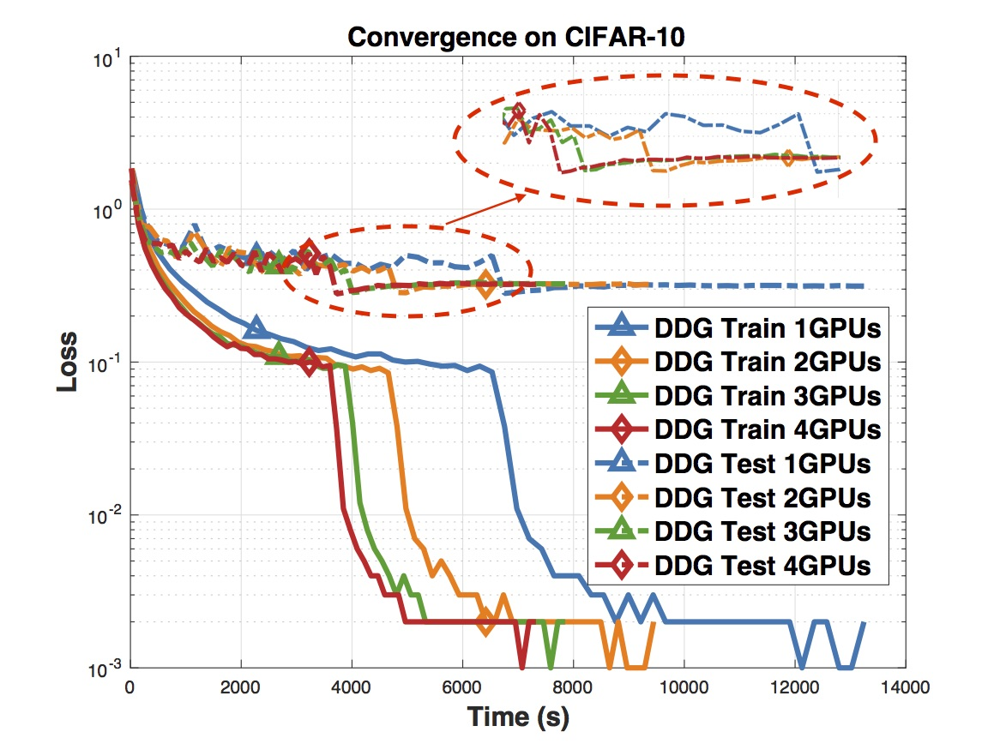

## Introduction

This repository is the PyTorch code for the paper "Decoupled Parallel Backpropagation with Convergence Guarantee" by Zhouyuan Huo, Bin Gu, Qian Yang and Huang, Heng, ICML 2018.

For any question or suggestions, feel free to contact zhouyuan.huo@pitt.edu

## Dependencies

Tested stable dependencies:
* Python 3.6.2 (Anaconda)
* PyTorch 0.3.1
* CUDA 8.0


## Run

* Run: `python main_split_bk.py ./data/cifar.python --dataset cifar10 --arch resnet_ddg --epochs 300 --learning_rate 0.01 --schedule 150 225 --gammas 0.1 0.1 --batch_size 128 --manualSeed 2 --depth 110 --splits 2
` 


## Result

Experimental results for optimizing ResNet110 on CIFAR10 using DDG.



**Note that to obtain the speedup in the paper, the code should be run in a machine with 4 GPUs.**


 
## Citation 

* Paper link: [https://arxiv.org/pdf/1804.10574.pdf)
```latex
@article{huo2018decoupled,
  title={Decoupled Parallel Backpropagation with Convergence Guarantee},
  author={Huo, Zhouyuan and Gu, Bin and Yang, Qian and Huang, Heng},
  journal={arXiv preprint arXiv:1804.10574},
  year={2018}
}
```
